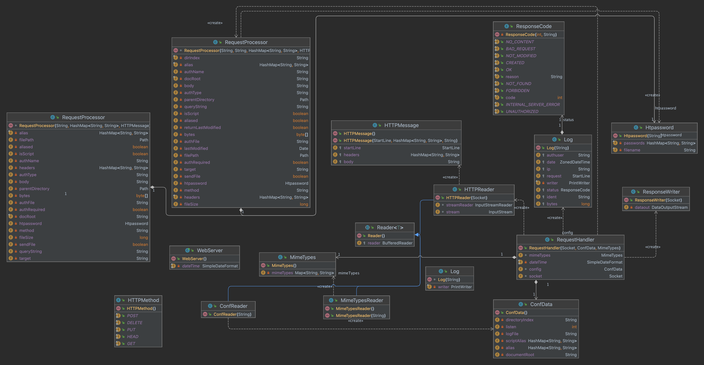

# CSC 667/867 Spring 2023 Web Server Project

## Team Information

| Full Name    | Course | Section |
|--------------|--------|---------|
| Joshua Hayes | 667    | 1       |
| Andy Shi     | 667    | 1       |

## Description of Architecture

### Root
WebServer: Runner, initializes server and creates threads for request processing.

### *reader* Package
**ConfData:** Data object to store parsed configuration data.  

**ConfReader:** Reads and parses configuration file into ConfData object.  

**Htpassword:** Parses, encrypts, and authenticates passwords.  

**HTTPReader:** Reads http requests given a socket connection.

**MimeTypes:** Data object to store parsed mimetypes data.

**MimeTypesReader:** Reads and parses mimetype file into MimeTypes object.

**Reader:** Generic reader class for ConfReader, HTTPReader, and MimeTypesReader.

### *ResponseRequest* Package

**HTTPMessage:** Data object for creating and storing HTTP messages. Also contains classes for storing the start line of requests and responses.

**HTTPMethod:** Enum for supported HTTP request types

**RequestHandler:** Reads and parses response into HTTPMessage object, hands off to RequestProcessor to be appropriately handled, and then writes a response output.

**RequestProcessor:** Handles resolving the path, processing requests based on type, and executing scripts.

**ResponseCode:** Enum for the possible response codes the server can respond with.

**ResponseWriter:** Writes output to socket.

### *Logging* Package

**Log:** Generates and outputs to specified log file.

## Challenges

The hardest part of the project was parsing the requests and then processing them appropriately. We initially had issues with using BufferedReader to read the body of the requests. This was resolved after learning that the request body should be read byte by byte into an array.
Implementing the Execute Server Scripts functionality was also a challenge as this was a first time using anything like process-builder in java to create new processes. The lecture material on using the class was helpful in getting started.

## Testing Plan

For most of our testing, we used the provided files and curl. Curl was used to test the functionality of the HTTP request types. The provided index.html was used to test threading, authentication, and scripts.
To test classes individually, we created main methods and used sample data to test each class and their methods before integrating with the rest of the webserver.

## Rubric (Check completed items)

### Code Quality (15 points)

| Completed | Points   | Description                                                             | Deductions                                                                                                                                              |
|-----------|----------|-------------------------------------------------------------------------|---------------------------------------------------------------------------------------------------------------------------------------------------------|
| [⎷]       |_5 points_| Code is clean, well formatted (appropriate white space and indentation) | (-2) Minor whitespace issues (missing whitespace between logical sections, excessive whitespace, functions, occasional misalignment, run-together code) | 
(-5) Major whitespace issues (inconsistent formatting, major misalignment, little use of whitespace, debug statements, inlined control flow)  
(-2) Tabs  
(-1) Failed to use explicit blocks  
(-1) Compile warning when compiling on command line  
(-1) if( expression ) return true; else return false should just return expression  
(-1) Debug output  
(-1) unused code paths (i.e. empty else block)" |
| [] | _5 points_ | Classes, methods, and variables are meaningfully named (no comments exist to explain functionality - the identifiers serve that purpose) | (-1) Unnecessary comments  
(-2) Poorly selected identifiers |
| [] | _3 points_ | Methods/Classes are small and serve a single purpose | (-1) Method is run on (contains multiple responsiblities that should have been refactored into separate functions)  
(-2) Poor class design (SRP violation, missing access modifiers, etc) |
| [] | _2 points_ | Code is well organized into a meaningful file structure | (-1) Should use packages to organize related code (i.e. config, ResponseRequest, etc.) |

### Documentation (30 points)

| Completed | Points      | Description                 | Deductions                                                                                                                               |
| --------- | ----------- | --------------------------- | ---------------------------------------------------------------------------------------------------------------------------------------- |
| [⎷]        | _3 points_  | Full names of team members  | (-1.5) Missing team member                                                                                                               |
| [⎷]        | _2 points_  | Rubric completed            | (-varies) Not clear what was marked off as completed?                                                                                    |
| [⎷]        | _10 points_ | Description of architecture | (-2) Difficult to read - I would suggest splitting into multiple, related groups of classes to make it easier for a reader to understand | 
(-2) Missing significant details (fields, methods, etc.)  
(-2) Description not clear |
| [] | _10 points_ | Challenges | (-varies) Not enough detail, no critical thinking |
| [] | _10 points_ | Testing Plan | (-varies) Testing items missing, unclear descriptions |

### Functionality - General Server Startup and Running Behavior (10 points)

| Completed | Points     | Description                                          | Deductions                  |
| --------- | ---------- | ---------------------------------------------------- | --------------------------- |
| [⎷]        | _3 points_ | Starts up and listens on correct port                | (-varies)                   |
| [⎷]        | _2 points_ | Logs in the common log format to stdout and log file | (-1) Does not log to stdout |

(-1) Does not log in coming log format  
(-1) debug output |
| [] | _5 points_ | Multithreading implemented |

### Functionality - Responses (23 points)

| Completed                         | Points     | Description                                                                | Deductions                                                      |
|-----------------------------------| ---------- | -------------------------------------------------------------------------- |-----------------------------------------------------------------|
| [⎷]                                | _2 points_ | 200                                                                        |                                                                 |
| [⎷]                                | _2 points_ | 201                                                                        | (-1) Failed to send created ResponseRequest code                |
| (-1) Does not add content to file |
| [⎷]                                | _2 points_ | 204                                                                        |                                                                 |
| [⎷]                                | _2 points_ | 400                                                                        | (-2) Failed to return 400 with improper request                 |
| [⎷]                                | _2 points_ | 401                                                                        | (-2) Does not check for htaccess (always asked for credentials) |
| [⎷]                                | _2 points_ | 403                                                                        | (-1) Fails to correctly parse password                          |
| [⎷]                                | _2 points_ | 404                                                                        |                                                                 |
| [⎷]                                | _2 points_ | 500                                                                        |                                                                 |
| [⎷]                                | _1 points_ | Required headers present (Server, Date)                                    | (-0.5) Did not include required header                          |
| [⎷]                                | _2 points_ | Response specific headers present as needed (Content-Length, Content-Type) |                                                                 |
| [⎷]                                | _1 points_ | Simple caching (HEAD results in 200 with Last-Modified header)             |                                                                 |
| [⎷]                                | _3 points_ | Response body correctly sent                                               |                                                                 |

### Functionality - Mime Types (2 points)

| Completed | Points     | Description                                                                                               | Deductions |
| --------- | ---------- | --------------------------------------------------------------------------------------------------------- | ---------- |
| [⎷]        | _2 points_ | Appropriate mime type returned based on file extension (defaults to text/text if not found in mime.types) |            |

### Functionality - Configuration (11 points)

| Completed | Points     | Description                                         | Deductions                    |
| --------- | ---------- | --------------------------------------------------- | ----------------------------- |
| [⎷]        | _1 points_ | Correct index file used (defaults to index.html)    |                               |
| [⎷]        | _1 points_ | Correct htaccess file used                          | (-1) 401/403 did not work     |
| [⎷]        | _1 points_ | Correct document root used                          |                               |
| [⎷]        | _3 points_ | Aliases working (will be mutually exclusive)        |                               |
| [⎷]        | _3 points_ | Script Aliases working (will be mutually exclusive) |                               |
| [⎷]        | _1 points_ | Correct port used (defaults to 8080)                | (-1) Does not default to 8080 |
| [⎷]        | _1 points_ | Correct log file used                               |                               |

### Functionality - CGI (9 points)

| Completed | Points     | Description                                            | Deductions                                                                     |
|-----------| ---------- | ------------------------------------------------------ | ------------------------------------------------------------------------------ |
| [⎷]       | _4 points_ | Correctly executes and responds                        | (-2) Does not execute some script aliased files (downloads it instead?)        |
| [⎷]       | _3 points_ | Receives correct environment variables                 | (-1) Does not receive standard env (-2) Does not receive HTTP and QUERY_STRING |
| [v]       | _2 points_ | Connects request body to standard input of cgi process | (-2) Not implemented                                                           |
